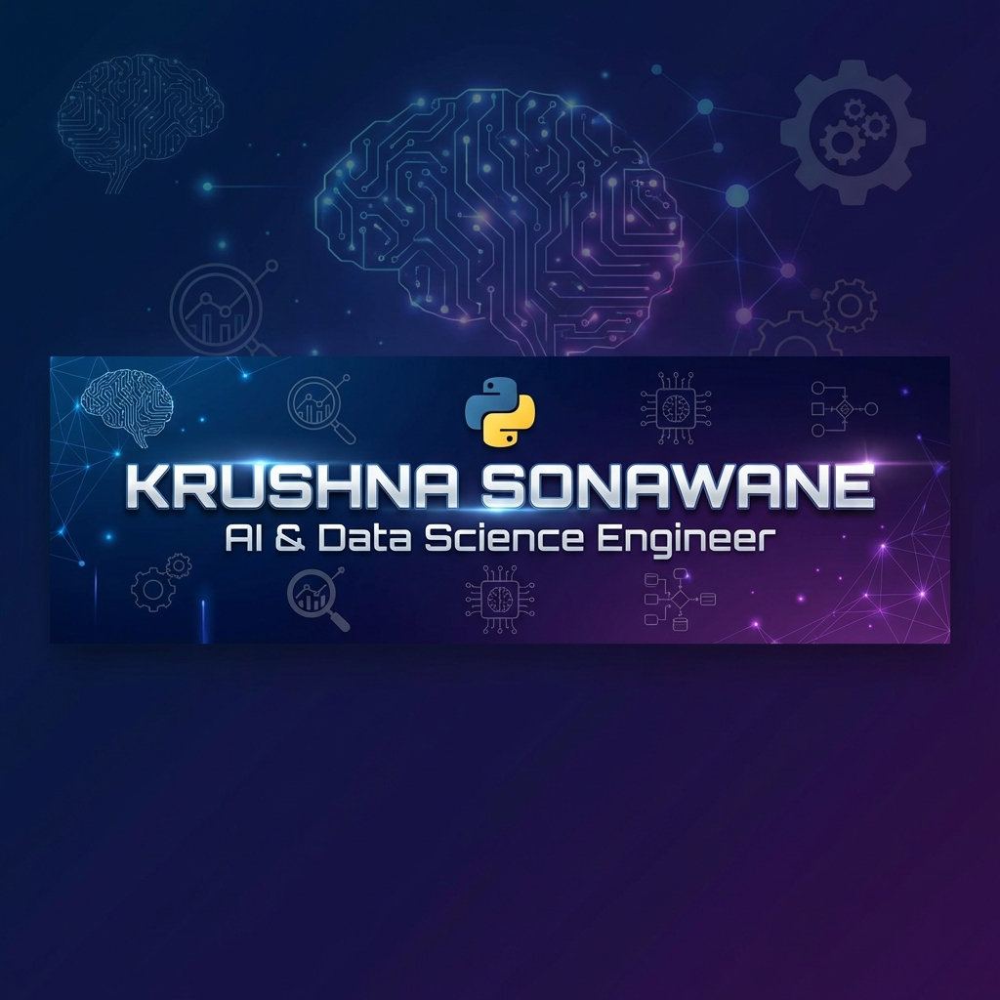
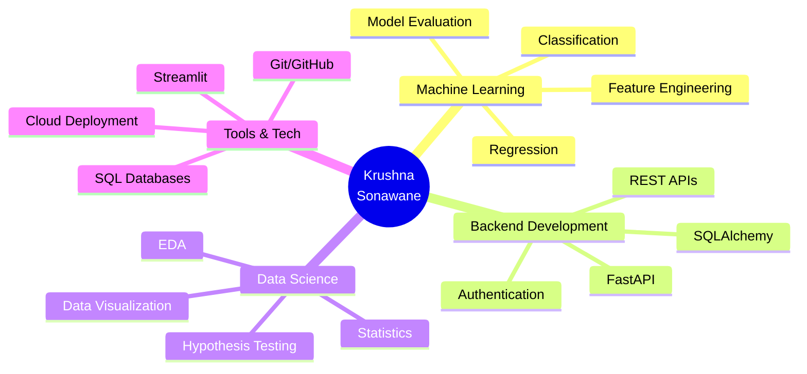

<div align="center">

<!-- Banner -->


<!-- Animated Typing -->
<p align="center">
  
</p>

<!-- Social Badges -->
<p align="center">
  <a href="https://github.com/KrushnaSonawane24">
    
  </a>
  <a href="https://linkedin.com/in/krushna-sonawane-16442b2b8">
    
  </a>
  <a href="mailto:sonawanekrushna830@gmail.com">
    
  </a>
  <a href="tel:+919322196346">
    
  </a>
</p>

<!-- Profile Views & Followers -->
<p align="center">
  
  
</p>

</div>

---

## 👨‍💻 About Me

```python
class KrushnaSonawane:
    def __init__(self):
        self.name = "Krushna Khandu Sonawane"
        self.location = "Nashik, Maharashtra 🇮🇳"
        self.education = "B.E. in AI & Data Science"
        self.college = "Guru Gobind Singh College of Engineering"
        self.graduation_year = 2026
        self.role = "AI & Data Science Student | Python Developer"
    
    def skills(self):
        return {
            "languages": ["Python", "SQL", "C++", "HTML/CSS"],
            "ml_frameworks": ["Scikit-Learn", "NumPy", "Pandas"],
            "backend": ["FastAPI", "REST API", "SQLAlchemy"],
            "databases": ["MySQL", "SQLite", "SQL Server"],
            "tools": ["Git", "GitHub", "Streamlit", "Render"],
            "visualization": ["Matplotlib", "Seaborn"]
        }
    
    def interests(self):
        return ["AI/ML", "Data Science", "Backend Development", "Problem Solving"]
    
    def current_focus(self):
        return ["Building ML Projects", "FastAPI Development", "Learning Deep Learning"]

me = KrushnaSonawane()
print(f"👋 Hello! I'm {me.name}, passionate about {', '.join(me.interests())}")
```

<div align="center">
  
</div>

---

## 🚀 What I Do

<table>
<tr>
<td width="50%">

### 🤖 Machine Learning
- Model Development & Training
- Regression & Classification
- Feature Engineering
- Model Evaluation & Tuning
- Achieved **90% accuracy** in recommendation systems

</td>
<td width="50%">

### ⚡ Backend Development
- FastAPI & REST APIs
- ML Model Deployment
- Database Integration (SQL)
- Authentication & Security
- End-to-End Project Execution

</td>
</tr>
</table>

---

## 💼 Professional Experience

### 🏢 Data Science Intern
**NetLeap IT & Training Solutions, Nashik** | *Jan 2025 - Feb 2025*

```diff
+ Developed ML-powered recommendation system with 90% accuracy
+ Implemented data preprocessing workflows using Pandas & NumPy
+ Built and deployed RESTful APIs using FastAPI
+ Collaborated on problem-solving and project documentation
+ Analyzed data-driven solutions using ML techniques
```

---

## 🛠️ Tech Stack

<div align="center">

### Languages
<p>
  
  
  
  
  
</p>

### Machine Learning & Data Science
<p>
  
  
  
  
  
</p>

### Backend & APIs
<p>
  
  
  
</p>

### Databases
<p>
  
  
  
</p>

### Tools & Platforms
<p>
  
  
  
  
  
</p>

### AI & Frameworks
<p>
  
  
  
</p>

</div>

---

## 🌟 Featured Projects

### 🎭 Interactive Story Generator — AI-Powered Adventure Platform
[](https://your-demo-link.com)
[](https://github.com/KrushnaSonawane24/interactive-story-generator)

**Tech Stack:** FastAPI • React • Groq AI (Llama 3.3 70B) • SQLAlchemy • SQLite

```yaml
Features:
  - Full-stack AI story generator with real-time generation
  - Integrated Groq Llama 3.3 70B through REST APIs
  - RESTful backend with SQLAlchemy ORM
  - Deployed on Render with production-ready setup
  
Highlights:
  - ✅ Real-time AI story generation
  - ✅ Modern React frontend
  - ✅ Scalable FastAPI backend
  - ✅ Cloud deployment
```

---

### 🎵 Music Recommendation System
[](https://github.com/KrushnaSonawane24/music-recommendation)

**Tech Stack:** Python • Pandas • NumPy • Scikit-Learn • Collaborative Filtering

```yaml
Features:
  - Hybrid recommendation using collaborative + content-based filtering
  - Analyzed 10,000+ songs dataset
  - Modular ML pipeline for preprocessing and training
  
Achievements:
  - 🎯 90% recommendation accuracy
  - 📊 Advanced feature extraction
  - 🔧 Model tuning & optimization
```

---

### 🚗 FastAPI Car Price Predictor
[](https://your-car-price-demo.com)
[](https://github.com/KrushnaSonawane24/fastapi-car-price)

**Tech Stack:** FastAPI • Scikit-Learn • Pandas • Streamlit

```yaml
Features:
  - ML-powered car price prediction API
  - Interactive Streamlit frontend
  - RESTful API endpoints
  - Real-time predictions
```

---

### 🛒 FastAPI E-Commerce API
[](https://github.com/KrushnaSonawane24/fastapi-ecommerce)

**Tech Stack:** FastAPI • SQLAlchemy • PostgreSQL • JWT Authentication

```yaml
Features:
  - Complete e-commerce backend
  - User authentication & authorization
  - Product management CRUD
  - Order processing system
```

---

### 🛰️ Remote Sensing Project
[](https://github.com/KrushnaSonawane24/remote-sensing)

**Tech Stack:** Python • Sentinel-2 • Geospatial Analysis

```yaml
Features:
  - Satellite imagery analysis
  - Geospatial data processing
  - Environmental monitoring
```

---

## 📊 GitHub Statistics

<div align="center">


</div>

<div align="center">
  
  
</div>

---

## 🏆 Achievements & Certifications

<div align="center">

| 🎓 Certification | 🏢 Organization | 📅 Date |
|------------------|-----------------|---------|
| **AI-ML Virtual Internship** | EduSkills | 2024 |
| **Data Science Virtual Internship** | TCS iON via Forage | Dec 2024 |
| **90% ML Model Accuracy** | NetLeap IT Solutions | Jan 2025 |

</div>

---

## 📈 Contribution Graph

<div align="center">
  
</div>

---

## 💡 Core Competencies

<div align="center">



</div>

---

## 🎯 Current Focus

<table>
<tr>
<td width="50%">

### 🔭 Working On
- 🤖 Advanced ML Models
- 🚀 FastAPI Projects
- 📊 Data Analysis Pipelines
- 🌐 Full-Stack AI Applications

</td>
<td width="50%">

### 🌱 Learning
- Deep Learning
- MLOps & Deployment
- Advanced SQL
- Cloud Technologies (AWS/Azure)

</td>
</tr>
</table>

---

## 📫 Let's Connect!

<div align="center">

### I'm always open to interesting conversations and collaboration opportunities!

<p>
  <a href="mailto:sonawanekrushna830@gmail.com">
    
  </a>
</p>

<p>
  <a href="https://linkedin.com/in/krushna-sonawane-16442b2b8">
    
  </a>
  <a href="https://github.com/KrushnaSonawane24">
    
  </a>
</p>

### 📍 Location: Nashik, Maharashtra, India

</div>

---

## 💭 Random Dev Quote

<div align="center">


</div>

---

## 🐍 Contribution Snake

<div align="center">


</div>

---

<div align="center">

### 🌟 "Code is like humor. When you have to explain it, it's bad." – Cory House


**Thanks for visiting! Happy Coding! 🚀**

<sub>Last Updated: January 2026</sub>

</div>
